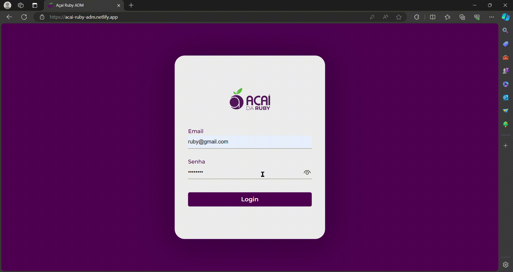
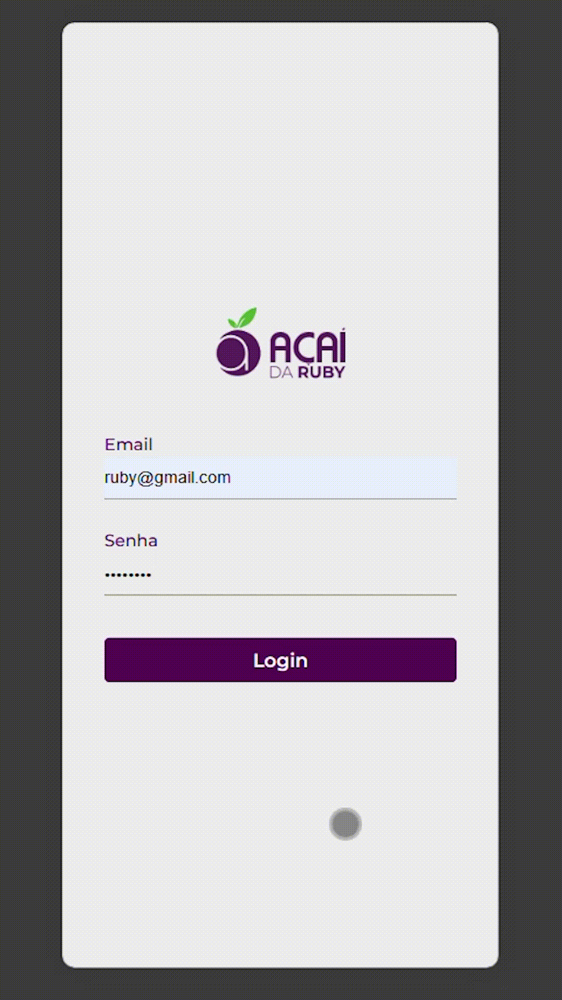

    

Sistema de administração responsivo para o totem [Açaí Ruby](https://github.com/rayaneacacio/Acai-Ruby), desenvolvido com TypeScript, ReactJS e Styled Components. Essa plataforma facilita o processo de gerenciamento da açaiteria, com ela é possível fazer requisicoes na [API do projeto](https://github.com/rayaneacacio/api-acai-ruby) para visualizar os pedidos, criar e apagar componentes de açaí e adicionar novos preços e tamanhos disponíveis de forma simples.

> Acesso: [acai-ruby-adm.netlify.app](https://acai-ruby-adm.netlify.app/)

email: ruby@gmail.com 
senha: ruby1234

 

    
    

##

---

  Made with 💜 by <a href="https://www.linkedin.com/in/rayane-ac%C3%A1cio-274092252/"> Rayane Acácio </a>

